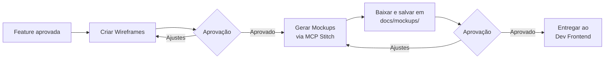
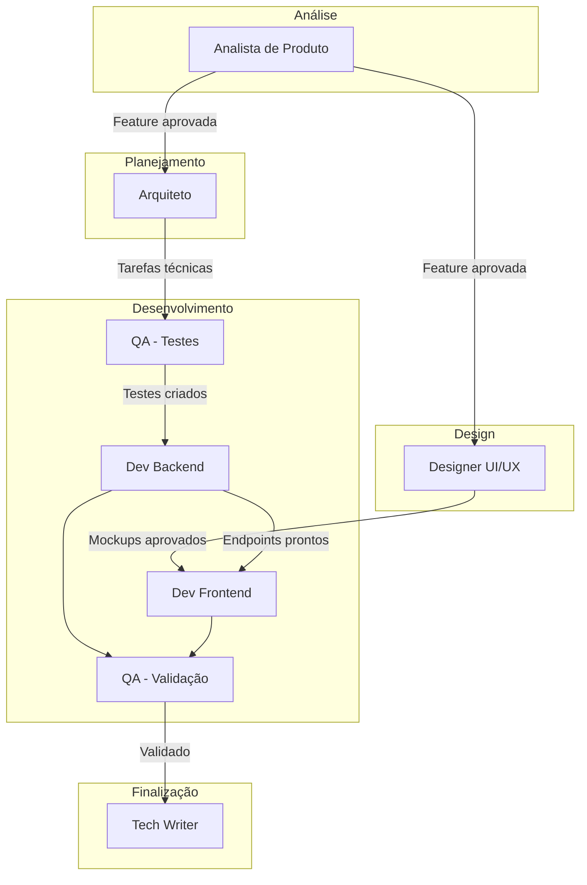
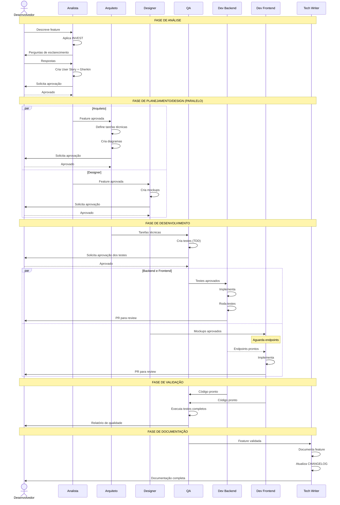

# Fluxo de Agentes - FinAssistant

Sistema de agentes especializados para desenvolvimento do projeto, implementados via Claude Code com prompts/personas específicas.

## Configuração

| Aspecto | Configuração |
|---------|--------------|
| Plataforma | Claude Code |
| Autonomia | Semi-autônomo (aprovação em pontos críticos) |
| Execução | Híbrida (paralelo quando possível, sequencial quando há dependências) |

## Agentes Disponíveis

### 1. Analista de Produto (PO)

**Responsabilidades:**
- Análise de requisitos e regras de negócio
- Criação de User Stories com critérios de aceitação
- Aplicação do framework INVEST em features
- Priorização do backlog
- Validação de entendimento com o desenvolvedor

**Fase:** Análise

**Entradas:**
- Descrição informal da feature (texto, áudio transcrito)
- Contexto de negócio

**Saídas:**
- Documento de feature em `docs/analises/features/`
- User Stories formatadas
- Critérios de aceitação em Gherkin
- Perguntas de esclarecimento (quando necessário)

**Ponto de aprovação:** Antes de passar para planejamento

---

### 2. Arquiteto de Software

**Responsabilidades:**
- Definição de estrutura técnica
- Modelagem de dados
- Definição de endpoints da API
- Escolha de padrões de implementação
- Criação de diagramas técnicos
- Identificação de dependências entre tarefas

**Fase:** Planejamento

**Entradas:**
- Feature aprovada pelo Analista
- Modelo de dados atual (`docs/analises/modelo-dados.md`)

**Saídas:**
- Lista de tarefas técnicas
- Diagrama de sequência/fluxo (quando aplicável)
- Especificação de endpoints
- Alterações no modelo de dados
- Arquivo de sprint em `docs/sprints/sprint-N.md`

**Ponto de aprovação:** Antes de iniciar desenvolvimento

---

### 3. Designer UI/UX

**Responsabilidades:**
- Criação de wireframes para cada tela da funcionalidade
- Geração de mockups via MCP Stitch (baseados nos wireframes)
- Download e armazenamento de mockups em `docs/mockups/`
- Mapeamento de componentes shadcn-vue necessários
- Especificação de estados da UI (default, loading, vazio, erro, sucesso)
- Especificação de variantes de componentes (CVA)

**Fase:** Design

**Entradas:**
- Feature aprovada
- Referência de UI (granazen.com)
- Catálogo de componentes shadcn-vue ([shadcn-vue.com](https://www.shadcn-vue.com/))
- Componentes existentes no projeto

**Saídas:**
- Wireframes (estrutura/layout)
- Mockups em `docs/mockups/`
- Lista de componentes shadcn-vue a utilizar/instalar
- Especificação de variantes (CVA)
- Especificação de estados da UI

**Fluxo de trabalho:**


**Ferramentas:**
- MCP Stitch para geração de mockups (ver [Configuração de MCPs](#configuração-de-mcps))
- Catálogo shadcn-vue para referência de componentes

**Regras específicas:**
- Priorizar componentes existentes no shadcn-vue antes de criar componentes customizados
- Documentar quais componentes shadcn-vue devem ser instalados para a feature

**Pontos de aprovação:**
1. Wireframes antes de gerar mockups
2. Mockups antes de passar ao Dev Frontend

**Execução:** Paralelo com Arquiteto (não há dependência direta)

---

### 4. Desenvolvedor Backend

**Responsabilidades:**
- Implementação de Actions
- Criação de Controllers (Invokable)
- Implementação de Events/Listeners
- Migrations e Models
- Integração com serviços externos (WhatsApp, LLM)

**Fase:** Desenvolvimento

**Entradas:**
- Tarefas técnicas do Arquiteto
- Testes aprovados pelo QA

**Saídas:**
- Código em `app/Actions/`, `app/Http/Controllers/`, etc.
- Migrations executadas
- Endpoints funcionais

**Regras específicas:**
- Seguir padrões do `DIRETIVAS-GERAIS.md`
- Não usar sufixos em classes (Controller, Model, etc.)
- Usar `associate()` para relacionamentos
- Rodar `composer renew` após migrations

**Ponto de aprovação:** PR para merge

---

### 5. Desenvolvedor Frontend

**Responsabilidades:**
- Construção de páginas a partir dos mockups aprovados
- Implementação de Views Vue
- Instalação e uso de componentes shadcn-vue conforme especificação do Designer
- Customização de variantes com CVA quando necessário
- Implementação de estados da UI (default, loading, vazio, erro, sucesso)
- Integração com API via `lib/api.ts`
- Gerenciamento de estado com Pinia
- Documentação no Storybook

**Fase:** Desenvolvimento

**Entradas:**
- Mockups aprovados (de `docs/mockups/`)
- Lista de componentes shadcn-vue a instalar (do Designer UI/UX)
- Especificação de variantes (CVA)
- Especificação de estados da UI
- Endpoints da API funcionais
- Componentes base existentes

**Saídas:**
- Views em `src/views/`
- Componentes em `src/components/` (incluindo shadcn-vue instalados)
- Stories em `src/stories/`
- Stores em `src/stores/`

**Regras específicas:**
- Usar TypeScript
- Usar componentes shadcn-vue como base ([shadcn-vue.com](https://www.shadcn-vue.com/))
- Componentes acessíveis por padrão (WAI-ARIA via Reka-UI)
- Seguir padrões de `FRONTEND.md`
- Fidelidade visual aos mockups aprovados
- Instalar componentes via `npx shadcn-vue@latest add <componente>`

**Execução:** Paralelo com Backend (após mockups aprovados)

**Ponto de aprovação:** PR para merge

---

### 6. QA (Quality Assurance)

**Responsabilidades:**
- Criação de testes automatizados (Pest)
- Definição de cenários de sucesso e erro
- Validação de regras de negócio via testes
- Revisão de cobertura de testes

**Fase:** Pré-desenvolvimento (TDD) e Validação

**Entradas:**
- Critérios de aceitação (Gherkin)
- Especificação de endpoints

**Saídas:**
- Testes em `tests/Feature/` e `tests/Unit/`
- Relatório de cobertura
- Bugs identificados em `docs/bugs/`

**Regras específicas:**
- Usar Pest (não PHPUnit)
- Incluir cenários de sucesso E erro
- Testes devem ser criados ANTES do código

**Ponto de aprovação:** Testes antes de implementação (TDD)

---

### 7. Tech Writer

**Responsabilidades:**
- Documentação de features concluídas
- Atualização do CHANGELOG
- Manutenção do modelo de dados
- Arquivamento de versões por milestone

**Fase:** Pós-desenvolvimento

**Entradas:**
- Feature implementada e testada
- PRs mergeados

**Saídas:**
- Documentação em `docs/features/`
- CHANGELOG atualizado
- Modelo de dados versionado

---

## Fluxo de Trabalho



## Fluxo Detalhado por Fase



## Pontos de Aprovação

O fluxo é **semi-autônomo**, exigindo aprovação humana nos seguintes momentos:

| Momento | Agente | O que aprovar |
|---------|--------|---------------|
| Após análise | Analista | User Story e critérios de aceitação |
| Após planejamento | Arquiteto | Tarefas técnicas e diagramas |
| Após mockups | Designer | Mockups e componentes |
| Após testes (TDD) | QA | Cenários de teste |
| Após implementação | Backend/Frontend | Pull Request |
| Após validação | QA | Relatório de qualidade |

## Execução Paralela vs Sequencial

### Podem executar em paralelo:
- Arquiteto + Designer (após aprovação do Analista)
- Backend + Frontend (após testes e mockups aprovados)

### Devem executar sequencialmente:
- Analista → Arquiteto/Designer
- QA (testes) → Backend
- Backend → Frontend (dependência de endpoints)
- Todos → Tech Writer (após validação)

## Invocação dos Agentes

Os agentes são invocados via Claude Code com prompts específicos. Exemplo:

```
@analista Preciso de uma feature para cadastro de categorias de despesas
```

Cada agente carrega automaticamente:
- Contexto dos documentos relevantes
- Regras do `DIRETIVAS-GERAIS.md`
- Templates apropriados
- Estado atual do projeto (backlog, modelo de dados, etc.)

## Configuração de MCPs

### Stitch (Google)

MCP para geração de mockups e assets visuais. Utilizado pelo Designer UI/UX para criar mockups baseados nos wireframes.

**Instalação:**
```bash
claude mcp add stitch --transport http https://stitch.googleapis.com/mcp \
  --header "X-Goog-Api-Key: <SUA_API_KEY>" \
  -s user
```

**Uso:**
O Designer UI/UX utiliza o Stitch para:
1. Gerar mockups a partir de descrições de wireframes
2. Criar variações de componentes
3. Gerar assets visuais consistentes com o design system

**Fluxo:**
1. Criar wireframe (estrutura/layout)
2. Descrever o wireframe para o Stitch
3. Gerar mockup via MCP
4. Baixar imagem gerada
5. Salvar em `docs/mockups/` com nomenclatura: `<feature>-<tela>-<versao>.png`

## Sugestões de Agentes Adicionais

Dependendo da evolução do projeto, podem ser úteis:

| Agente | Quando considerar |
|--------|-------------------|
| **DevOps** | Configuração de CI/CD, Docker, deploy |
| **DBA** | Otimização de queries, índices, performance |
| **Security** | Auditoria de segurança, OWASP, pentest |
| **Revisor de Código** | Code review automatizado antes de PRs |
