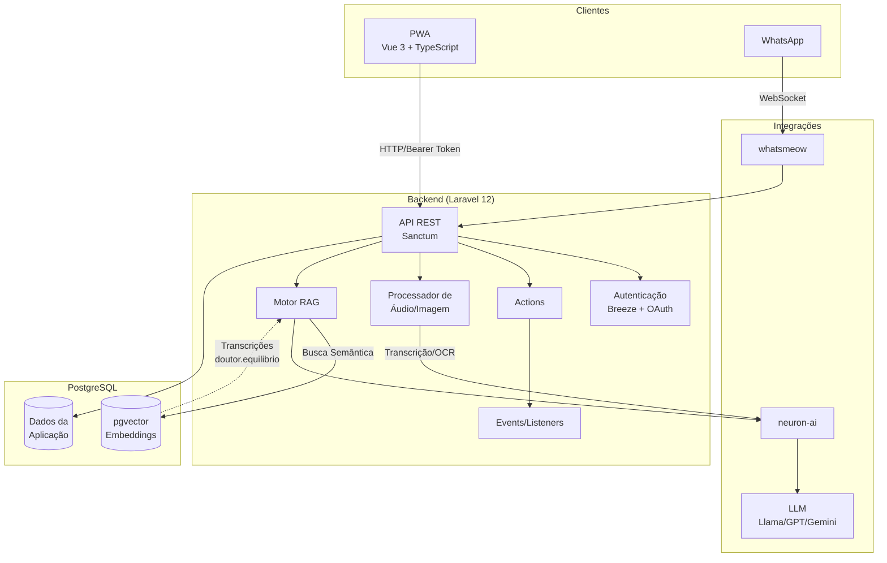
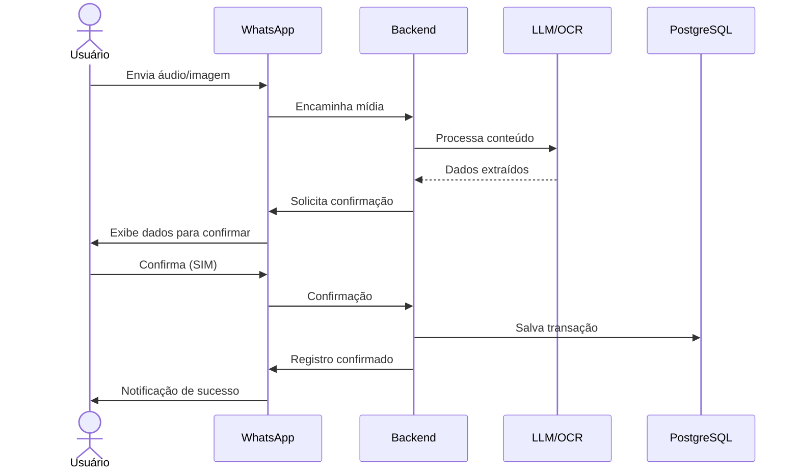
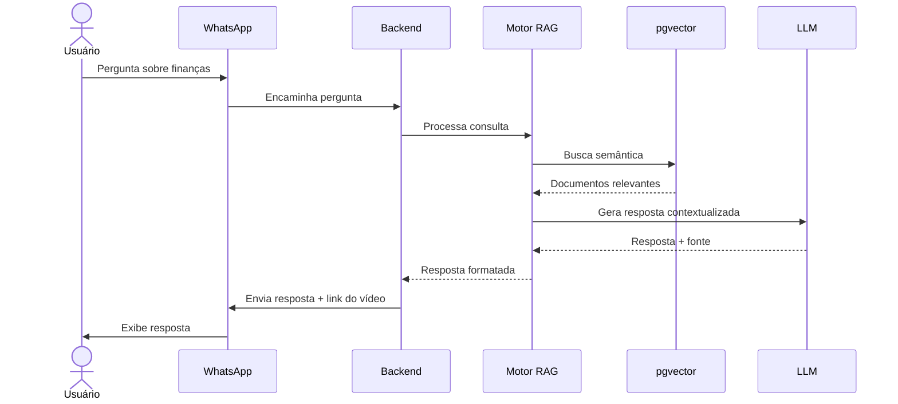

# FinAssistant

Assistente financeiro pessoal com integração WhatsApp e inteligência artificial.

> **Nota**: O nome "FinAssistant" é temporário e passará por rebrand futuramente.

## Visão Geral

FinAssistant é uma aplicação multi-tenant para gestão de finanças pessoais que permite aos usuários registrar receitas e despesas através de múltiplos canais de entrada (aplicação web, áudio e imagens via WhatsApp). A aplicação também oferece um assistente inteligente que responde dúvidas sobre educação financeira com base em conteúdo do canal [doutor.equilibrio](https://youtube.com/@doutor.equilibrio) no YouTube.

## Funcionalidades Principais

### Registro de Transações

O usuário pode registrar receitas e despesas através de:

| Canal | Método | Categorização |
|-------|--------|---------------|
| Aplicação Web | Formulário manual | Manual |
| Aplicação Web | Upload de áudio | Automática (IA) |
| Aplicação Web | Upload de comprovante (imagem) | Automática (OCR + IA) |
| WhatsApp | Mensagem de áudio | Automática (IA) |
| WhatsApp | Envio de comprovante (imagem) | Automática (OCR + IA) |

Para registros via áudio ou imagem, o sistema extrai automaticamente os dados (valor, data, estabelecimento, categoria) utilizando processamento de linguagem natural e OCR.

#### Fluxo de Confirmação

Registros originados de áudio ou imagem passam por confirmação antes de serem salvos:

1. Usuário envia áudio ou imagem (via WhatsApp ou aplicação web)
2. Sistema processa e extrai os dados (valor, categoria, estabelecimento, data)
3. Sistema envia mensagem de confirmação com os dados interpretados
4. Usuário confirma ou corrige as informações
5. Transação é registrada no sistema

**Exemplo de confirmação via WhatsApp:**
> **Usuário:** [áudio] "Gastei 47 reais no mercado hoje"
>
> **FinAssistant:** Entendi o seguinte registro:
> - **Tipo:** Despesa
> - **Valor:** R$ 47,00
> - **Categoria:** Alimentação
> - **Estabelecimento:** Mercado
> - **Data:** 27/03/2026
>
> Confirma? Responda *SIM* para salvar ou envie as correções.

### Gestão de Contas

- Cadastro de múltiplas contas por usuário (carteira, bancos, etc.)
- Associação de transações a contas específicas
- Visualização de saldo por conta

### Transações Recorrentes

- Cadastro de despesas e receitas recorrentes (salário, aluguel, assinaturas, etc.)
- Lista de pendências com seleção múltipla
- Cálculo dinâmico do montante total das transações selecionadas

**Exemplo de uso:**
> O usuário possui as seguintes pendências cadastradas:
> - Pensão 1: R$ 600
> - Pensão 2: R$ 600
> - Material Escolar 1: R$ 345
> - Material Escolar 2: R$ 147
> - Aluguel: R$ 2.000
>
> Ao selecionar todas exceto "Aluguel", o sistema exibe o total: **R$ 1.692**

### Metas e Alertas

- Definição de metas de gastos por categoria
- Configuração de alertas personalizados:
  - Percentual de atingimento (padrão: 80%)
  - Alertas por conta específica
- Notificações quando o limite configurado for atingido

### Relatórios e Visualizações

- Gráficos de gastos por categoria
- Relatórios mensais
- Comparativos entre períodos
- Totalização por categoria no mês corrente

> **Referência de UI/UX**: [granazen.com](https://granazen.com)

### Assistente Inteligente (WhatsApp)

O assistente responde perguntas dos usuários via WhatsApp (texto ou áudio) em duas modalidades:

#### Educação Financeira
- Consulta base de conhecimento com transcrições do canal doutor.equilibrio
- Utiliza RAG (Retrieval-Augmented Generation) para respostas contextualizadas
- Formato da resposta: breve contextualização + link do vídeo fonte

#### Dados Pessoais
- Consulta de saldo das contas
- Gráficos simples de totalização por categoria (mês corrente)

## Arquitetura

### Stack Tecnológica

#### Frontend (PWA)

| Tecnologia | Versão | Propósito |
|------------|--------|-----------|
| Vue.js | 3.x | Framework reativo |
| TypeScript | - | Tipagem estática |
| Tailwind CSS | 4.x | Estilização utilitária |
| Pinia | - | Gerenciamento de estado |
| shadcn-vue | - | Biblioteca de componentes UI |
| Reka-UI | - | Primitivos acessíveis (WAI-ARIA) |
| Vite | - | Build tool |

> **Componentes:** Utilizamos [shadcn-vue](https://www.shadcn-vue.com/) como biblioteca de componentes. Os componentes são copiados para o projeto, permitindo customização total.

> Repositório separado do backend

#### Backend

| Tecnologia | Versão | Propósito |
|------------|--------|-----------|
| Laravel | 12.x | Framework principal |
| Breeze | - | Scaffolding de autenticação |
| Sanctum | - | Autenticação API (tokens) |
| neuron-core/neuron-ai | - | Integração com LLMs |
| whatsmeow | - | Integração WhatsApp |

> Repositório separado do frontend

#### Banco de Dados

| Tecnologia | Propósito |
|------------|-----------|
| PostgreSQL | Banco principal |
| pgvector | Extensão para embeddings (RAG) |

### Padrões de Desenvolvimento

O projeto segue padrões específicos documentados em [DIRETIVAS-GERAIS.md](DIRETIVAS-GERAIS.md):

| Padrão | Descrição |
|--------|-----------|
| **Action Driven Development** | Lógica de negócio encapsulada em Actions reutilizáveis |
| **Event Driven Development** | Comunicação entre módulos via eventos |
| **Invokable Controllers** | Controllers com método único (`__invoke`) |
| **SOLID** | Princípios de design orientado a objetos |
| **Object Calisthenics** | Regras para código limpo e manutenível |

### Modelos de LLM

| Ambiente | Modelo |
|----------|--------|
| Desenvolvimento | Llama (via Ollama, local) |
| Produção | GPT ou Gemini (em avaliação) |

### Diagrama de Arquitetura



#### Fluxo de Registro via WhatsApp



#### Fluxo de Consulta ao Assistente



## Autenticação

Sistema multi-tenant com isolamento de dados por usuário.

**Métodos de autenticação:**
- Usuário e senha (Breeze)
- OAuth 2.0:
  - Google
  - GitHub
  - LinkedIn

**Proteção da API:**
- Laravel Sanctum (tokens Bearer)
- CSRF para requisições web

## Estrutura de Repositórios

```
FinAssistant/
├── backend/          # Laravel 12 (API)
└── frontend/         # Vue 3 + TypeScript (PWA)
```

## Documentação Relacionada

- [Diretivas Gerais](DIRETIVAS-GERAIS.md) - Padrões de código e fluxo de trabalho
- [Frontend Vue.js](FRONTEND.md) - Detalhes da implementação frontend
- [Actions](ACTIONS.md) - Padrão Action Driven Development
- [Testes Automatizados](TESTES-AUTOMATIZADOS.md) - Diretrizes de testes
- [Relacionamentos](RELACIONAMENTOS.md) - Padrões de relacionamento no Eloquent
- [pgvector vs Qdrant](PGVECTOR-VS-QDRANT.md) - Decisão de banco vetorial
