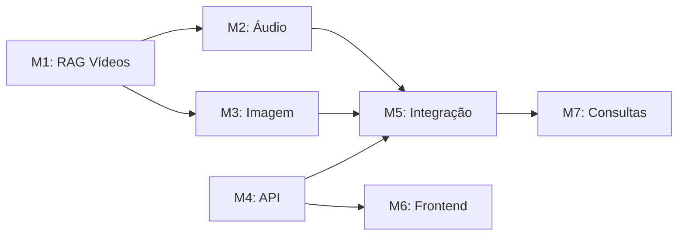

# Milestones - FinAssistant

Marcos do projeto que agrupam funcionalidades relacionadas.

**Convenção:** Milestones são reativos - novos marcos podem ser inseridos antes de outros na fila conforme necessidade do negócio.

---

## Índice de Milestones

| ID | Nome | Status | Descrição |
|----|------|--------|-----------|
| M1 | Sugestão de Vídeos (RAG) | **Concluído** | Webhook para sugestão de vídeos baseado em perguntas via WhatsApp |
| M2 | Análise de Áudio | Pendente | Extração de dados de pagamentos a partir de áudios WhatsApp |
| M3 | Análise de Imagem | Pendente | OCR para extração de dados de comprovantes/notas fiscais |
| M4 | API Financeira | Pendente | Backend completo para gestão de registros financeiros |
| M5 | Integração Áudio/Imagem → API | Pendente | Registro automático dos dados extraídos na API |
| M6 | Interface Gráfica | Pendente | Frontend Vue.js para a aplicação |
| M7 | Consultas de Posições | Pendente | Respostas sobre totais e saldos via WhatsApp |

---

## M1 - Sugestão de Vídeos (RAG)

**Status:** Concluído
**Dependências:** Nenhuma
**Plano detalhado:** [docs/milestones/M1-SUGESTAO-VIDEOS-RAG.md](milestones/M1-SUGESTAO-VIDEOS-RAG.md)

### Sprints

| Sprint | Foco | Status |
|--------|------|--------|
| [Sprint 01](sprints/m1-sprint-01.md) | Infraestrutura | Pendente |
| [Sprint 02](sprints/m1-sprint-02.md) | RAG Core | Pendente |
| [Sprint 03](sprints/m1-sprint-03.md) | Endpoints + Interface | Pendente |

### Descrição

Endpoint webhook que recebe perguntas sobre educação financeira via WhatsApp e retorna sugestões de vídeos do canal [doutor.equilibrio](https://youtube.com/@doutor.equilibrio).

### Arquitetura

```
WhatsApp → App Go (whatsmeow) → Webhook FinAssistant → RAG → Resposta → App Go → WhatsApp
```

### Escopo

- [ ] Endpoint webhook para receber pergunta + número WhatsApp
- [ ] Base de conhecimento com transcrições dos vídeos (pgvector)
- [ ] Motor RAG para busca semântica
- [ ] Formatação de resposta com link do vídeo fonte
- [ ] Retorno da resposta para a app Go

### Dados de Entrada

```json
{
  "phone": "5511999999999",
  "message": "Como economizar dinheiro ganhando pouco?",
  "type": "text"
}
```

### Dados de Saída

```json
{
  "phone": "5511999999999",
  "response": "Sobre economia com baixa renda, o Dr. Equilíbrio explica...",
  "video_url": "https://youtube.com/watch?v=xxx",
  "video_title": "5 Dicas para Economizar Ganhando Pouco"
}
```

### Funcionalidades Detalhadas

1. **Ingestão de transcrições**
   - Download de transcrições do YouTube
   - Chunking do conteúdo
   - Geração de embeddings
   - Armazenamento no pgvector

2. **Busca semântica**
   - Embedding da pergunta do usuário
   - Busca por similaridade no pgvector
   - Recuperação dos chunks relevantes

3. **Geração de resposta**
   - Contexto dos chunks + pergunta → LLM
   - Resposta contextualizada + referência ao vídeo

---

## M2 - Análise de Áudio

**Status:** Pendente
**Dependências:** M1 (infraestrutura de webhook)

### Descrição

Processamento de mensagens de áudio enviadas via WhatsApp para extração de informações sobre pagamentos/gastos.

### Escopo

- [ ] Endpoint webhook para receber áudio + número WhatsApp
- [ ] Transcrição de áudio (speech-to-text)
- [ ] Extração de entidades (valor, categoria, estabelecimento, data)
- [ ] Detecção de conta de origem/destino
- [ ] **Fallback para conta temporária** (ver [Classificação Pendente](features/classificacao-pendente.md))
- [ ] Estruturação dos dados extraídos
- [ ] Envio de mensagem de confirmação via WhatsApp
- [ ] **Upload de áudio via interface web** (chat.html) para testes com arquivos baixados do WhatsApp

### Dados de Entrada

```json
{
  "phone": "5511999999999",
  "message": "base64_do_audio",
  "type": "audio",
  "mimetype": "audio/ogg"
}
```

### Dados de Saída (para confirmação)

```json
{
  "phone": "5511999999999",
  "response": "Entendi o seguinte:\n- Tipo: Despesa\n- Valor: R$ 47,00\n- Categoria: Alimentação\n- Estabelecimento: Mercado\n- Data: 28/03/2026\n\nConfirma? Responda SIM ou envie correções.",
  "extracted_data": {
    "type": "expense",
    "amount": 47.00,
    "category": "Alimentação",
    "merchant": "Mercado",
    "date": "2026-03-28"
  },
  "awaiting_confirmation": true
}
```

### Fluxo de Confirmação

1. Usuário envia áudio
2. Sistema transcreve e extrai dados
3. Sistema envia confirmação via WhatsApp
4. Usuário responde SIM → dados são marcados para registro
5. Usuário envia correção → sistema reprocessa

---

## M3 - Análise de Imagem

**Status:** Pendente
**Dependências:** M1 (infraestrutura de webhook)

### Descrição

Processamento de imagens (comprovantes, notas fiscais, cupons) enviadas via WhatsApp para extração de informações sobre pagamentos.

### Escopo

- [ ] Endpoint webhook para receber imagem + número WhatsApp
- [ ] OCR para extração de texto da imagem
- [ ] Extração de entidades (valor, estabelecimento, data, itens)
- [ ] Detecção de conta de origem/destino
- [ ] **Fallback para conta temporária** (ver [Classificação Pendente](features/classificacao-pendente.md))
- [ ] Estruturação dos dados extraídos
- [ ] Envio de mensagem de confirmação via WhatsApp

### Dados de Entrada

```json
{
  "phone": "5511999999999",
  "message": "base64_da_imagem",
  "type": "image",
  "mimetype": "image/jpeg"
}
```

### Dados de Saída

Similar ao M2, com dados extraídos via OCR.

### Tipos de Documento Suportados

- Cupom fiscal
- Nota fiscal (NFC-e, NF-e)
- Comprovante de transferência (Pix, TED)
- Boleto pago
- Fatura de cartão

---

## M4 - API Financeira

**Status:** Pendente
**Dependências:** Nenhuma (pode ser desenvolvido em paralelo com M1-M3)

### Descrição

Backend Laravel completo para gestão de registros financeiros. Autenticação via WhatsApp será portada do play.jukebar.app.

### Escopo

#### Autenticação
- [ ] Portar autenticação WhatsApp do play.jukebar.app
- [ ] Sanctum para tokens de API
- [ ] Middleware de tenant (isolamento por usuário)

#### Contas Bancárias
- [ ] CRUD de contas
- [ ] Tipos: carteira, banco, cartão de crédito
- [ ] Saldo atual calculado
- [ ] Conta padrão para WhatsApp

#### Categorias
- [ ] CRUD de categorias
- [ ] Cores personalizadas
- [ ] Categorias padrão no onboarding
- [ ] Limite de gasto por categoria

#### Transações
- [ ] CRUD de receitas e despesas
- [ ] Associação com conta e categoria
- [ ] Status: pendente, confirmado
- [ ] Origem: manual, áudio, imagem
- [ ] Data de vencimento vs data de pagamento

#### Recorrências
- [ ] Despesas e receitas recorrentes
- [ ] Frequência: mensal, semanal, anual
- [ ] Geração automática de pendências

#### Relatórios
- [ ] Totais por período
- [ ] Totais por categoria
- [ ] Saldo disponível vs previsto

### Modelo de Dados (Simplificado)

```
users
├── accounts (contas bancárias)
├── categories (categorias)
├── transactions (transações)
│   ├── account_id
│   ├── category_id
│   └── recurrence_id (nullable)
└── recurrences (recorrências)
```

---

## M5 - Integração Áudio/Imagem → API

**Status:** Pendente
**Dependências:** M2, M3, M4

### Descrição

Conectar os dados extraídos de áudio (M2) e imagem (M3) com a API financeira (M4) para registro automático após confirmação do usuário.

### Escopo

- [ ] Fluxo de confirmação via WhatsApp (similar ao jukebar)
- [ ] Mapeamento de categorias extraídas para categorias do usuário
- [ ] Registro de transação na API após confirmação
- [ ] Feedback de sucesso/erro via WhatsApp
- [ ] Tratamento de correções do usuário

### Fluxo Completo

```
1. Usuário envia áudio/imagem
2. M2/M3 extrai dados
3. Sistema envia confirmação
4. Usuário confirma (SIM)
5. M5 registra na API (M4)
6. Sistema envia confirmação de registro
```

---

## M6 - Interface Gráfica

**Status:** Pendente
**Dependências:** M4

### Descrição

Frontend Vue.js (PWA) para a aplicação financeira, seguindo referência visual do GranaZen.

### Escopo

- [ ] Autenticação (login via WhatsApp)
- [ ] Dashboard com resumo financeiro
- [ ] Gestão de contas bancárias
- [ ] Gestão de categorias
- [ ] Listagem e filtro de transações
- [ ] Cadastro manual de transações
- [ ] Gestão de recorrências
- [ ] Relatórios e gráficos
- [ ] Configurações do usuário

### Referência

Ver documentação: [GranaZen - Análise de Referência](mockups/referencia/GRANAZEN-REFERENCIA.md)

### Stack

- Vue 3 + TypeScript
- Tailwind CSS 4
- Pinia
- shadcn-vue
- Vite

---

## M7 - Consultas de Posições

**Status:** Pendente
**Dependências:** M4, M5

### Descrição

Permitir que usuários consultem informações financeiras via WhatsApp (texto ou áudio).

### Escopo

- [ ] Interpretação de perguntas sobre finanças pessoais
- [ ] Consulta de saldo das contas
- [ ] Totais por categoria no período
- [ ] Comparativo com mês anterior
- [ ] Formatação de resposta para WhatsApp

### Exemplos de Consultas

| Pergunta | Resposta |
|----------|----------|
| "Quanto tenho nas minhas contas?" | "Saldo total: R$ 3.450,00\n- Nubank: R$ 2.000\n- Carteira: R$ 1.450" |
| "Quanto gastei com alimentação esse mês?" | "Você gastou R$ 847,00 com Alimentação em março/2026" |
| "Como estou esse mês?" | "Março/2026:\n- Receitas: R$ 5.000\n- Despesas: R$ 3.200\n- Saldo: R$ 1.800" |

---

## Dependências entre Milestones



---

## Ordem de Execução Sugerida

1. **M1** - Base da infraestrutura (webhook, LLM, pgvector)
2. **M4** - Pode iniciar em paralelo (API independente)
3. **M2** - Após M1 (reutiliza webhook e LLM)
4. **M3** - Após M1 (reutiliza webhook e LLM)
5. **M5** - Após M2, M3 e M4
6. **M6** - Após M4 (pode iniciar antes de M5)
7. **M7** - Por último (depende de tudo funcionando)
